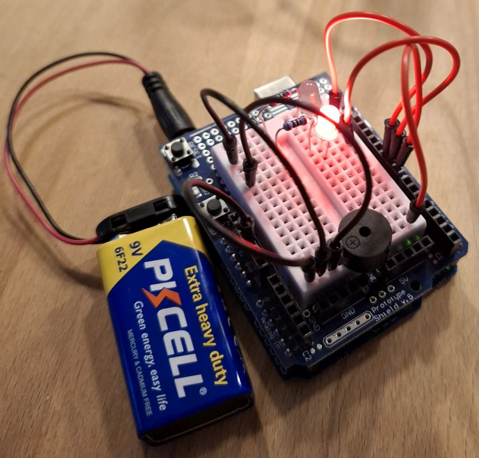
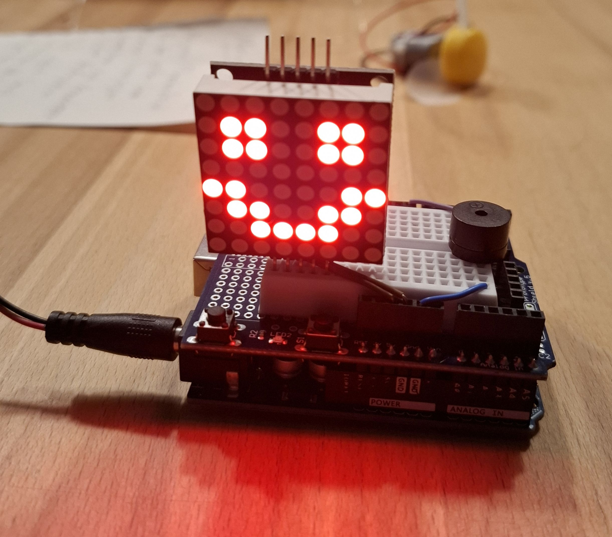

# Sofies Arduino (Elegoo) Programme

Sofies Sammlung toller Arduino-Programme, aufgebaut mit dem Elegoo Uno R3 Starter Kit.

## [1. Der Buzzer Pirat](1-buzzer-pirat/)

Spielt "He is a Pirate" mit Buzzer und optionalen LEDs.

## [2. LED Matrix](2-led-matrix/)

Zeigt Bilder auf der LED Matrix

